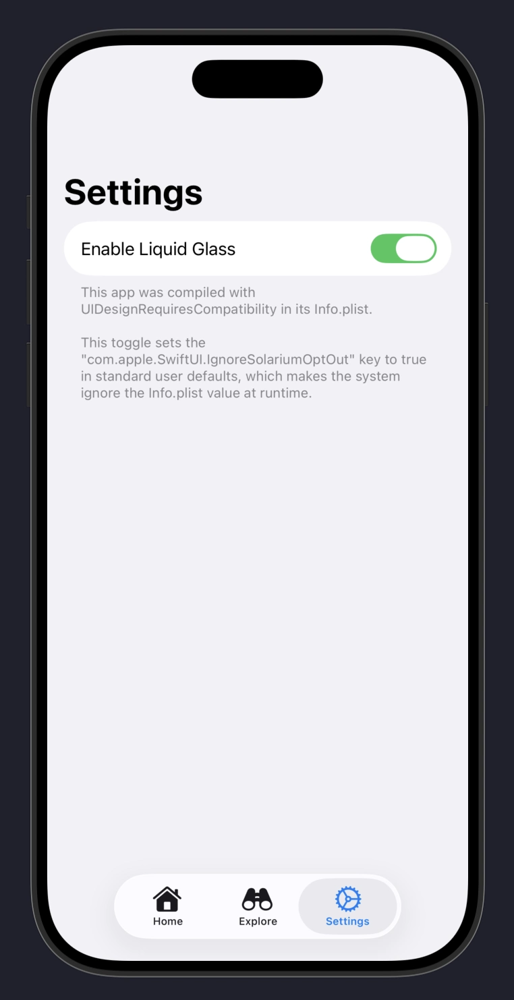

# Enable Liquid Glass dynamically in an iOS app

This sample project demonstrates how a user defaults flag can be used to dynamically enable/disable Liquid Glass in an app.

## How it works

I personally wouldn't do this in a production app, but I was asked about how apps such as WhatsApp were able to do phased rollouts of Liquid Glass,
so I decided to explore how it could be done, which is actually quite simple.

There are multiple ways of doing it, but I think the mechanism used in this sample project is the simplest and least likely to cause serious problems at runtime.

The setup is:

- Build the app with the iOS 26 SDK
- Include the [UIDesignRequiresCompatibility](https://developer.apple.com/documentation/bundleresources/information-property-list/uidesignrequirescompatibility) property in the app's Info.plist with a value of `YES`, which disables Liquid Glass by default
- Set the `com.apple.SwiftUI.IgnoreSolariumOptOut` in standard user defaults to `true` to force-enable Liquid Glass on demand

The only gotcha is that Liquid Glass is only enabled/disabled after the app is quit and relaunched, since UIKit/SwiftUI read that defaults flag early in the app's lifecycle
and cache the result for the lifetime of the process.

For a phased rollout or feature flag approach where you'd want a decision upon first launch, that defaults flag would have to be written before `UIApplicationMain`,
which can be done in a `main.swift` file for a traditional UIKit app or in the app's initializer for an app using the SwiftUI lifecycle.

This example demonstrates a random selection on first launch implemented in the SwiftUI `App` initializer.

